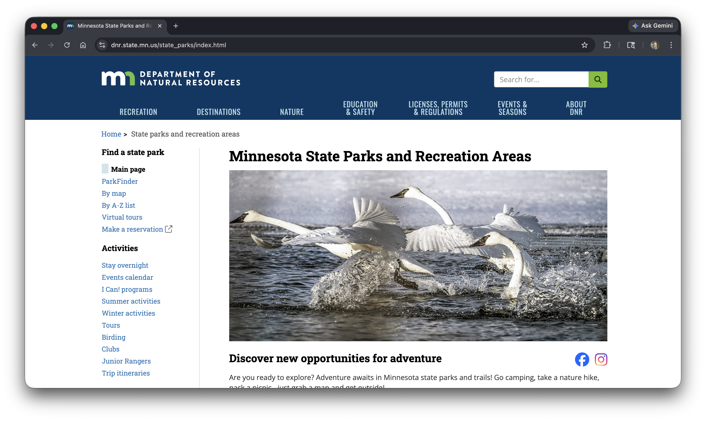
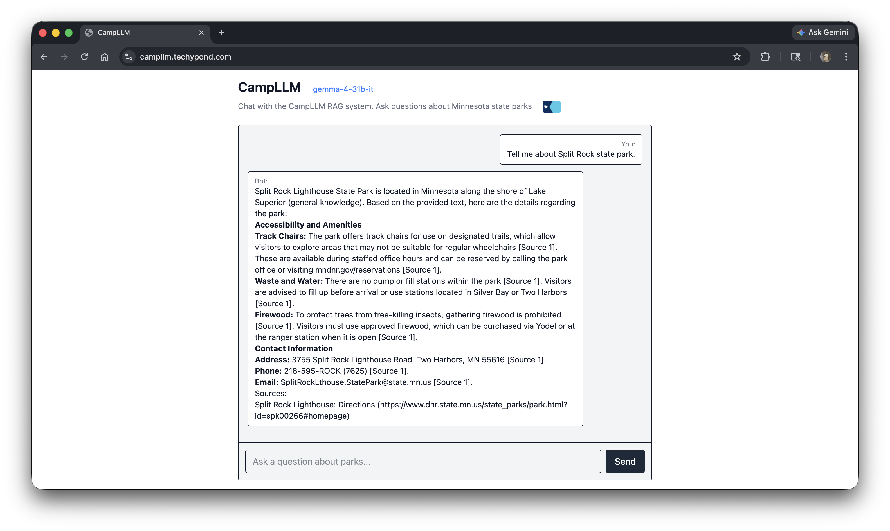

# CampLLM

<p class="text-3xl text-white italic !opacity-80">A better way for searching Minnesota state parks using AI</p>

<p class="absolute bottom-6 left-6 italic text-sm text-white">By Luca Comba</p>

---
transition: fade-out
---

<div class="absolute inset-0 -z-10">
  
  <div class="absolute inset-0 bg-black/75"></div>
</div>

## DNR

[Minnesota DNR](https://www.dnr.state.mn.us/state_parks/index.html) has rich information, but searching is hard in practice.

<div v-click>

- Information is spread across many nested pages and sections.
- Useful details are mixed with boilerplate and long page text.
- Questions like "Which parks near Twin Cities have X amenity?" are not easy to answer quickly.
- People often end up manually browsing multiple pages and tabs.

<p class="mt-4 text-sm opacity-80">
  Goal: make park information conversational, faster to access, and source-grounded.
</p>

</div>



---
transition: fade-out
---

# Why have we built CampLLM?

CampLLM is a Retrieval-Augmented Generation (RAG) assistant for Minnesota State Parks.

<div v-click>

- Crawls and collects DNR park content.
- Cleans and chunks text into searchable units.
- Indexes chunks in Chroma vector database.
- Retrieves relevant chunks per question.
- Uses Gemini/Gemma models to generate answers with source references.

</div>

---
transition: slide-up
level: 2
---

# System Pipeline

<div class="grid grid-cols-1 gap-4 text-left md:grid-cols-2">
  <div class="rounded border border-white/20 bg-white/5 p-4">
    <p class="mb-2 text-sm uppercase tracking-wide opacity-70">Build index</p>
    <ol class="space-y-2 text-base">
      <li>DNR pages</li>
      <li>Crawler</li>
      <li>Cleaner</li>
      <li>Indexer</li>
      <li>Embeddings + ChromaDB</li>
    </ol>
  </div>
  <div class="rounded border border-white/20 bg-white/5 p-4">
    <p class="mb-2 text-sm uppercase tracking-wide opacity-70">Answer question</p>
    <ol class="space-y-2 text-base">
      <li>User question</li>
      <li>Retrieve top-k chunks</li>
      <li>LLM answer</li>
      <li>CLI / Web API</li>
    </ol>
  </div>
</div>

<p class="mt-4 text-sm opacity-80">Core scripts: <code>park</code>, <code>database</code>, <code>chat</code></p>

---

## Chroma 

a Vector database for storing all Minnesota state park collected documents, here is the Park collection:

```python
class ParkCollection:
    def __init__(self, client, embedding_function=None):
        self.client = client
        self.embedding_function = embedding_function
        self._collection_name = "parks"

        # Initialize the underlying ChromaDB collection immediately
        self.collection = self.client.get_or_create_collection(
            name=self._collection_name,
            embedding_function=self.embedding_function,
        )

    def query(self, query_text: str, n_results: int = 5):
        return self.collection.query(
            query_texts=[query_text],
            n_results=n_results,
            include=["documents", "metadatas"],
        )
```

---

# Embeddings

For our Chroma we have used the [minishlab/potion-base-8M](https://huggingface.co/minishlab/potion-base-8M)

We had to use the `register_embedding_function` Chroma decorator

```python
from chromadb import EmbeddingFunction
from chromadb.utils.embedding_functions import register_embedding_function
from model2vec import StaticModel

@register_embedding_function
class Embedding(EmbeddingFunction):
    def __init__(
      self, 
      model_name: str = "minishlab/potion-base-8M"
    ):
        self.model_name = model_name
        self.model = StaticModel.from_pretrained(self.model_name)
```

---

# RAG

the `RAG.ask(question)` orchestrates retrieval + generation:

1. Query Chroma for top-k relevant chunks.
2. Build a context block with `[Source N]` metadata.
3. Create a grounded prompt for the LLM.
4. Generate response using chat session.
5. Parse citations and return filtered source list.

Implementation behavior:

- Uses retrieved context for park-specific facts.
- Allows general knowledge only for framing.
- Encourages explicit source citations in answer text.

---

## [campllm.techypond.com](https://campllm.techypond.com)

We created a FastAPI backend `/api/chat`, `/api/model` to server a Vue-based minimal chat UI.



---

# Results

We asked: "Tell me about Fort Snelling state park"

```
Bot:
Fort Snelling State Park is located in Minnesota (general knowledge). 
Based on the provided text, here are the details regarding the park:

Visitor Information and Hours

Park Hours: Open daily from 8 a.m. to 10 p.m. [Source 3].
Ranger Station Hours: Open daily from 9 a.m. to 3:30 p.m., though these hours may change due to staffing [Source 3].
Closures: Facilities are closed on Christmas Day and Thanksgiving Day [Source 3].
Requirements: All visitors must have a vehicle permit to enter the park [Source 1].
Amenities and Facilities

Visitor Center: The Thomas C. Savage Visitor Center is located two miles from the park entrance and includes a gift shop (The Nature Store), meeting rooms, flush toilets, interpretive exhibits, an amphitheater, and a sheltered picnic area [Source 4].
Memorial Chapel: The park has a non-denominational Memorial Chapel available for funerals [Source 3].
Additional Services: Track chairs are available for reservation [Source 2]. Firewood may be purchased at the ranger station or via Yodel [Source 3].
Programs: Naturalist programs are available year-round [Source 4].
Activities and Highlights

Highlights: The park offers fishing, cross-country skiing, bike trails, interpretive exhibits, and the Dakota memorial [Source 3].
Historic Site: While the park features a historic site, Historic Fort Snelling is operated by the Minnesota Historical Society, is located outside the state park, and requires additional entry fees [Source 4].
Current Alerts and Trail Status

Management: The state park is separate from nearby federally managed areas, such as the Whipple Building [Source 1].
Visitor Center Status: From May through September, the Thomas C. Savage Visitor Center is closed on Mondays, except for May 25th [Source 1].
Trail Access: Trailheads at the Ranger Station are closed due to construction; visitors must access trails a mile further on Snelling Lake Rd at the beach access parking lots [Source 1].
Open/Closed Areas:
Open: The Minnehaha Trail, Picnic Island, the Dakota Memorial (Wokiksuye K'a Woyuonihan), and Pike Island (though biking is prohibited on Pike Island) [Source 1].
Closed: The northwest portion of the Snelling Lake Trail is closed for construction [Source 1].
Sources:

Fort Snelling: Alerts and notices (https://www.dnr.state.mn.us/state_parks/park.html?id=spk00154#alerts)
Fort Snelling: Reservations (https://www.dnr.state.mn.us/state_parks/park.html?id=spk00154#reservations)
Fort Snelling: Directions (https://www.dnr.state.mn.us/state_parks/park.html?id=spk00154#homepage)
Fort Snelling: Amenities (https://www.dnr.state.mn.us/state_parks/park.html?id=spk00154#amenities)
```

---

# Future Improvements

- Add third-party data (user reviews, geolocation context, photos).
- Improve prompt design and response formatting consistency.
- Add stronger reranking for better top-k relevance.
- Improve multi-turn memory handling for cleaner chat sessions.

---

<div class="absolute inset-0 -z-10">
  
  <div class="absolute inset-0 bg-black/45"></div>
</div>

<p class="text-xl">Thank you!</p>

<div class="absolute bottom-40 text-xl">

Contact: comb6457@stthomas.edu

Website: [campllm.techypond.com](https://campllm.techypond.com/)

GitHub: [github.com/lukfd/campllm](https://github.com/lukfd/campllm)
</div>
